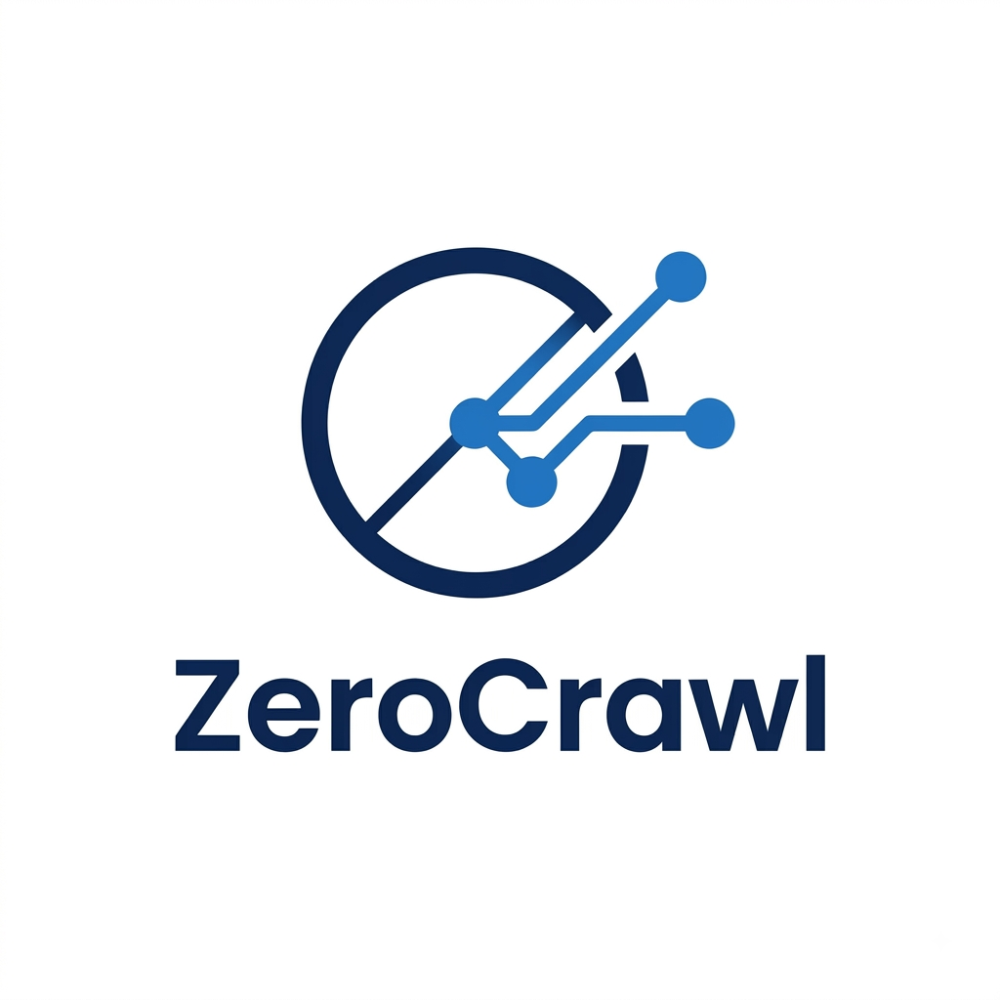

<div align="center">
  
  <h1>ZeroCrawl MCP — Open Source Web Crawler & Scraper for Model Context Protocol</h1>
  <p><em>The Zero-Cost, Zero-Binary Web Crawling & Scraping Engine for Model Context Protocol (MCP).</em></p>

  [](https://opensource.org/licenses/MIT)
  [](https://vercel.com)
  [](https://www.typescriptlang.org/)
  [](https://modelcontextprotocol.io/)
  [](http://makeapullrequest.com)
</div>

---

## 🚀 1-Click Deploy

Deploy your own private instance of ZeroCrawl in seconds:

[](https://vercel.com/new/clone?repository-url=https%3A%2F%2Fgithub.com%2FYOUR_USERNAME%2Fzerocrawl-mcp&project-name=zerocrawl-mcp&repository-name=zerocrawl-mcp&env=AUTH_TOKEN&envDescription=Optional%3A+Set+a+secret+Bearer+token+to+protect+your+MCP+server.)

---

## 📊 Comparison Matrix

| Feature | ZeroCrawl | FireCrawl | Default Agent Tools |
|---------|-----------|-----------|---------------------|
| **Monthly Hosting Cost** | $0 | $16+ | N/A |
| **Binary Footprint** | 0MB | 150MB+ | N/A |
| **Token Optimization** | Clean Markdown | Raw Clutter | Mixed |
| **Multi-Page Concurrency** | Yes | Yes | No |
| **SPA / JS Fallback** | Yes (Jina Reader) | Yes | No |

---

## 🛠 Detailed Tool Specifications

| Tool Name | Parameters | Description | Output Format |
|-----------|------------|-------------|---------------|
| `scrape_page` | `url` (string) | Fetches URL, cleans DOM with Readability, converts to Markdown, auto-fallback to Jina Reader on 403/SPA. | Markdown |
| `crawl_domain` | `startUrl` (string), `maxPages` (number, optional), `maxDepth` (number, optional) | Recursive same-domain link crawler with depth control and concurrency caps. | JSON |
| `extract_metadata` | `url` (string) | Structured OpenGraph, Twitter Cards, schema JSON-LD, and canonical data. | JSON |
| `get_screenshot_and_media` | `url` (string) | High-res full-page screenshot URL via Microlink + image URL extraction with alt tags. | JSON |
| `parse_sitemap` | `domainUrl` (string) | XML sitemap and sitemap index parser. | JSON |
| `batch_scrape` | `urls` (string[]) | Concurrent multi-URL scraping engine. | Array of Markdown |
| `search_and_crawl` | `query` (string), `limit` (number, optional) | Fetch web search results and concurrently scrape each target link. | JSON |

---

## 💻 Client Configuration Guide

### Claude Desktop (`claude_desktop_config.json`)

**Open Access:**
```json
{
  "mcpServers": {
    "zerocrawl": {
      "command": "npx",
      "args": ["-y", "@modelcontextprotocol/server-vercel", "https://your-deployment-url.vercel.app/api/mcp"]
    }
  }
}
```

**Authenticated (Bearer Token):**
```json
{
  "mcpServers": {
    "zerocrawl": {
      "command": "npx",
      "args": ["-y", "@modelcontextprotocol/server-vercel", "https://your-deployment-url.vercel.app/api/mcp"],
      "env": {
        "AUTH_TOKEN": "your-secret-token"
      }
    }
  }
}
```

### Cursor IDE (`.cursor/mcp.json`)
```json
{
  "mcpServers": {
    "zerocrawl": {
      "command": "https://your-deployment-url.vercel.app/api/mcp",
      "type": "sse",
      "env": {
        "Authorization": "Bearer your-secret-token"
      }
    }
  }
}
```

### Windsurf / Antigravity / Claude Code
Configure the SSE endpoint with `https://your-deployment-url.vercel.app/api/mcp`. Include the `Authorization: Bearer your-secret-token` header if you have set an `AUTH_TOKEN`.

---

## 🏗 Architecture & Vercel Free Plan Optimization

ZeroCrawl is built from the ground up to operate within the constraints of Vercel's Free Tier:
- **Sub-9s Timeout Safeguards:** Operations automatically gracefully downgrade or return partial data to prevent serverless timeouts.
- **In-Memory TTL Caching Layer:** Eliminates redundant fetching and scraping by returning instant responses for recent queries within a 10-minute window.
- **Zero-Chromium Architecture:** Bypasses the need for heavy headless browsers. It leverages smart HTTP fetchers, DOM cleanup with Mozilla's Readability, and Turndown for clean Markdown generation. For complex SPAs or blocks, it automatically falls back to Jina Reader APIs.

---

## 🤝 Local Development & Contributing

1. Clone the repository
2. Install dependencies: `npm install`
3. Run the development server: `npm run dev`
4. Use MCP inspector or client to test the server at `http://localhost:3000/api/mcp`

Contributions are welcome! Please check the `.github` templates before opening issues or pull requests.

---

## 🤔 FAQ

**What is ZeroCrawl MCP?**
ZeroCrawl MCP is an open-source, serverless web crawler and scraper designed specifically to run on Vercel's Free Tier and integrate instantly with AI coding assistants. 

**What is the best free web crawler for MCP?**
ZeroCrawl MCP provides a 100% free hosting architecture by utilizing Vercel's serverless functions and removing heavy browser binaries (like Puppeteer/Chromium), making it the best free web crawler for MCP environments.

**How to scrape the web with Cursor IDE and Vercel for free?**
You can deploy ZeroCrawl MCP to your own Vercel account in 1-Click (which costs $0/month on the hobby plan). Then, add the resulting `/api/mcp` URL to Cursor IDE's MCP settings using the SSE transport. This provides Cursor with full web scraping capabilities instantly.

---

## 📄 License

MIT License (2026). See [LICENSE](LICENSE) for details.
